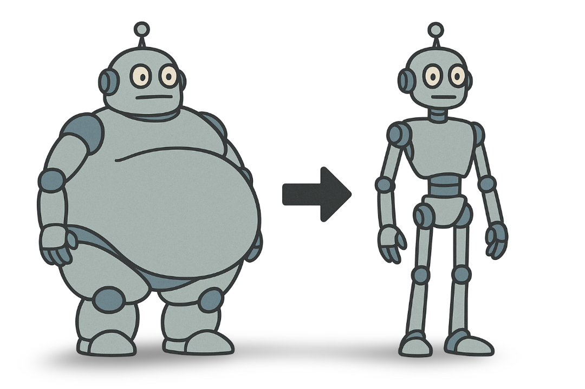
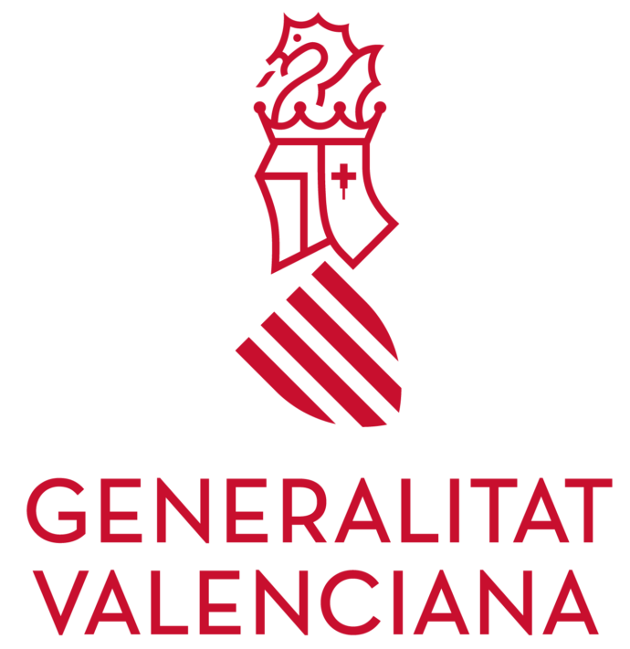
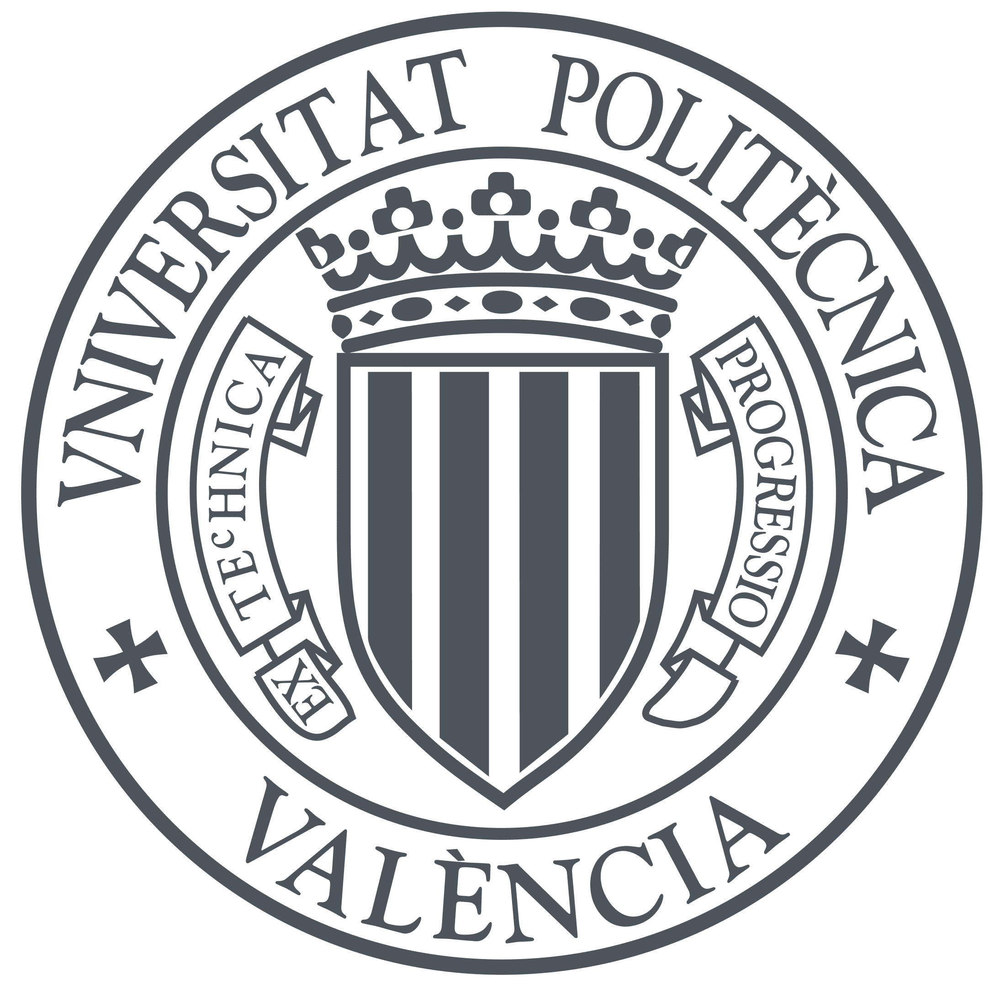
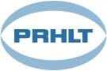

# Bienvenidos/as a LightVED

    

Bienvenidos a la página web oficial del proyecto **LightVED: Lightweight Vision Encoder Decoder for multi-modal transcription problems**, desarrollado por el grupo de investigación **PRHLT** (Pattern Recognition and Human Language Technologies) de la Universitat Politècnica de València (UPV).

## Descripción del proyecto

**LightVED** es una iniciativa de investigación centrada en mejorar los modelos **encoder-decoder** que conectan visión por computador y procesamiento de lenguaje natural. Nuestro objetivo es crear arquitecturas ligeras y eficientes que permitan aplicaciones prácticas con menor coste computacional.

## Líneas de investigación

- Procesamiento multimodal (visión + lenguaje) para la investigación médica
- Compresión de arquitecturas Transformer aplicadas a visión y lenguaje
- Reconocimiento de texto manuscrito (HTR, HDR)
- Lip reading basado en vídeo

## Agradecimientos

Este proyecto ha sido subvencionado por el programa **PROMETEO (CIPROM/2023/17)** de la Generalitat Valenciana.

    
    
    

---

*Esta página web está en constante actualización. Última revisión: Junio, 2025*